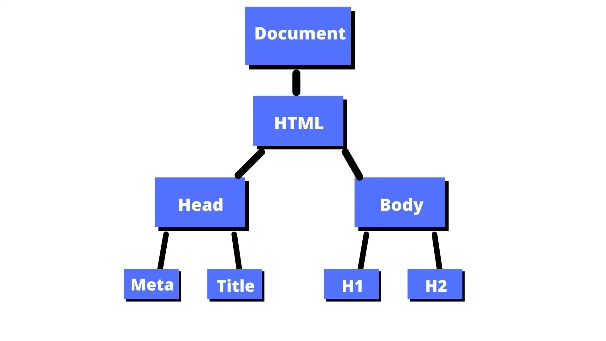

Pergunta: O que o navegador faz com o HTML que escrevemos?

O navegador lê o HTML, mas não fica trabalhando em cima do arquivo de texto — ele constrói uma representação viva disso na memória. É essa representação que se chama DOM (Document Object Model).

O HTML é criado em hierarquia (tag dentro de tag), por isso, o DOM se parece com uma "árvore genealógica".

No DOM, cada nó, deixa de ser um texto no HTML e vira um objeto javascript, com propriedades e métodos.

Pensem no HTML como a planta de uma casa, e no DOM, como a casa construída.